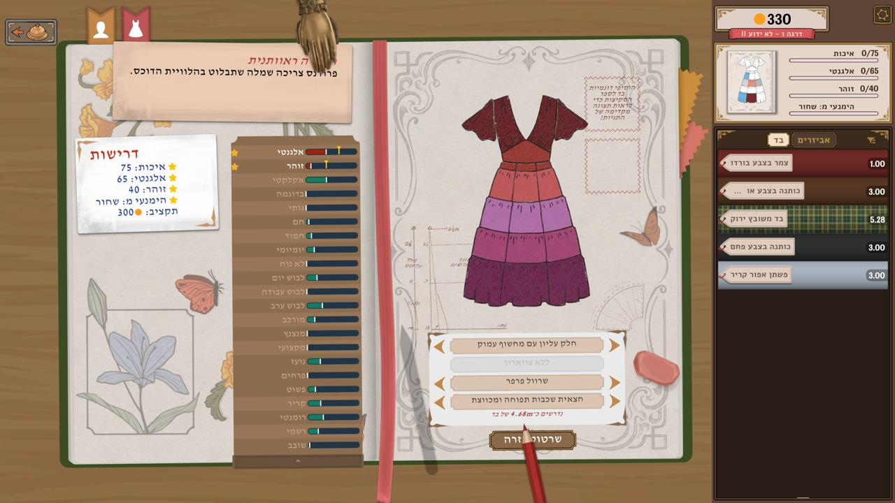
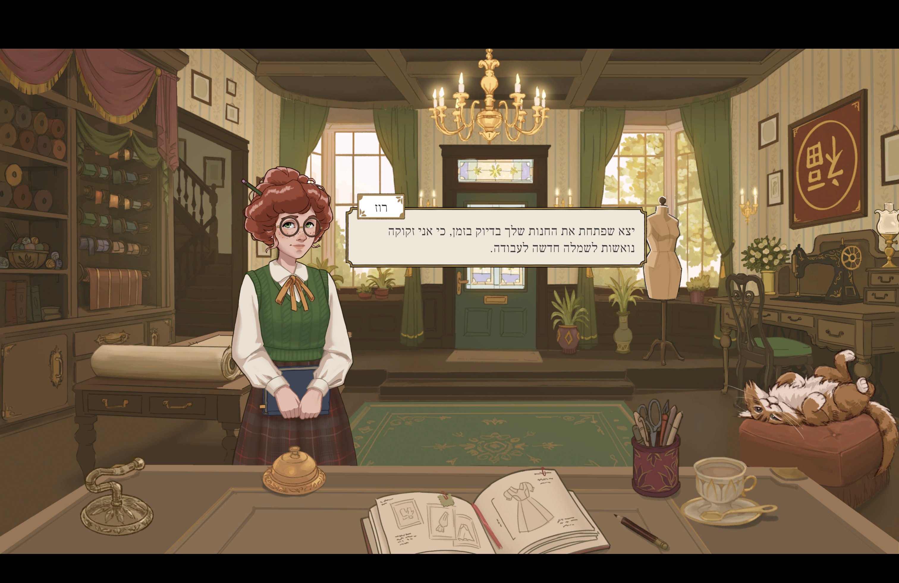

# Dressmaker Hebrew

Unofficial Hebrew localization for the macOS Steam edition of Dressmaker, tested
against build **25508059** (game version 410). This is a beta with all 5,886
extracted strings translated and reviewed. Full gameplay QA remains pending.

**Unofficial fan project:** this repository is not affiliated with, sponsored by,
or endorsed by Cozy Lives, Free Lives, or Valve. It is intended as a free,
noncommercial accessibility effort and requires a legitimately owned copy of
Dressmaker. Rights in the original game, story, artwork, and screenshots remain
with their respective owners; this project grants no rights to those materials.
No game binaries or original English text tables are distributed here. The
translation and tools were made with AI assistance and reviewed; they are not an
official or professional localization. See [comparable fan projects and the
permission distinction](docs/FAN_PROJECTS.md).





## Setup

Start with the **[step-by-step macOS setup guide](docs/SETUP.md)**. It covers
GitHub access, installing Python and .NET, checking the game version, building,
installing, updating translations, and restoring English. There is no one-click
installer yet: the adapter builds the patch from your own copy of the game.

## Two separate parts

- `translation/`: standalone UTF-8 Hebrew translation pack, keyed by game string
  IDs. `pack.json` identifies the language, tested build, files and entry counts.
  Each row contains `id`, `he`, and a SHA-256 hash of the original English string.
  The hash lets the adapter reject changed source text without redistributing it.
- `adapter/`: Dressmaker-specific installer, build tools, Hebrew font selection,
  RTL handling, and vendored RTLTMPro source with its license.

The translation pack contains no Unity assemblies, game bundles, original English
text tables, saves, or backups. The adapter builds patched files from the player's
own installed game. Generated game files and local backups are excluded from Git.
Translation updates currently require rebuilding and reinstalling; the game does
not load this pack directly at runtime.

## Build and install at a glance

After completing the prerequisites in [the setup guide](docs/SETUP.md), run these
from the repository directory with Dressmaker closed:

```sh
source .venv/bin/activate
"$DRESSMAKER_DOTNET/dotnet" build adapter/Patcher/Patcher.csproj -o adapter/build/patcher
python adapter/build.py
python adapter/install.py
```

Keep the game's language set to **English**. To uninstall, close the game and run
`python adapter/install.py restore` from the same repository and virtual environment.
Keep `adapter/backups/` so the installer can restore your original files.

## Status and third-party licenses

All 208 UI, 71 tutorial, 1,930 content and 3,677 dialogue entries have a Hebrew
translation and received a second language pass. Instructions generally address
one female player. Fonts follow the game's original roles. Hebrew kerning is
disabled to avoid a reproduced RTL punctuation collision; italics remain active.

Still to check: long dialogue, typewriter reveal, settings layout, sewing screens,
measurements, currency sprites and mixed punctuation. Text embedded in images and
hardcoded strings are outside the extracted tables. Windows is not supported yet.

Font licenses are in `adapter/fonts/FONT-LICENSES.txt`. RTLTMPro's MIT license is
in `adapter/vendor/RTLTMPro/LICENSE`. No original game binaries are distributed.
